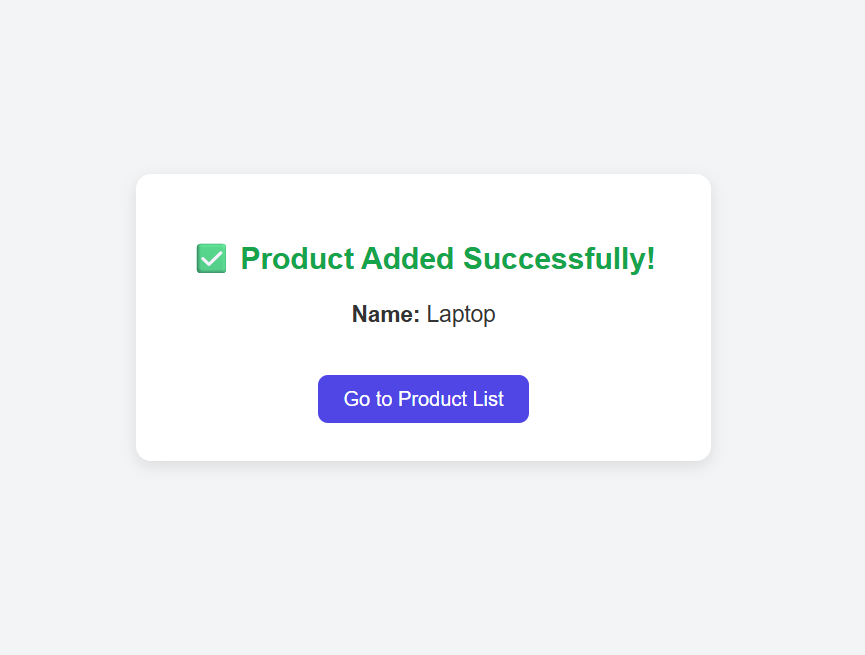
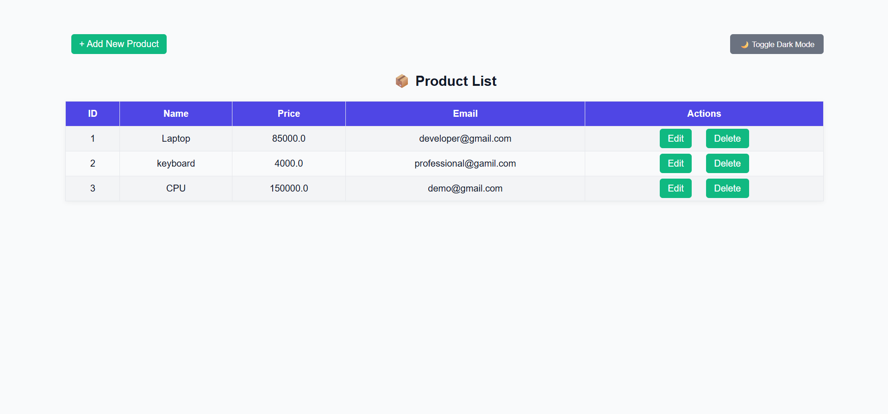

# 🛍️ Spring Boot Product Management App

A mini CRUD application built with Spring Boot, Thymeleaf, JPA, and H2.

## 🧰 Features

- Add, View, Edit, and Delete products
- Uses Spring Data JPA + H2 in-memory database
- UI with Thymeleaf templates

## 🖼️ Screenshots
### add product


### confirmation


### Product List View


### H2 Database


## 📦 Tech Stack

- Spring Boot 3.x
- Spring MVC + Thymeleaf
- Spring Data JPA
- H2 In-Memory DB

## ▶️ Run Locally

```bash
mvn spring-boot:run

